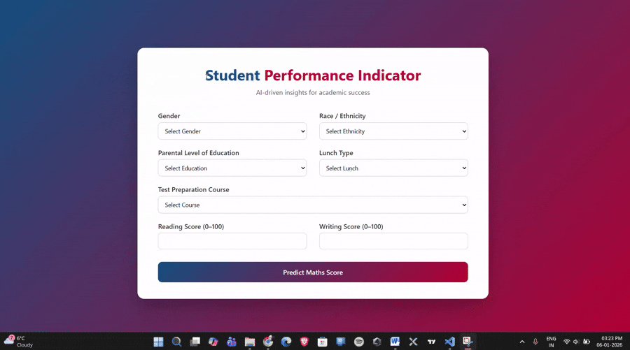

# 🎓 Student Performance Indicator  
### 🏆 Best Model: **Ridge Regression** | **R² Score: 0.880593**

> **Predicting student academic performance using Machine Learning**

A complete **end-to-end Machine Learning project** that predicts a student’s **Maths score** based on demographic and academic attributes.  
The project includes **Exploratory Data Analysis (EDA), model training, preprocessing pipelines, and a Flask-based web application** for real-time predictions.

---

## 🎥 Demo

---

## 🚀 Features

- 📊 Exploratory Data Analysis (EDA)
- 🧠 Machine Learning model training
- ⚙️ Data preprocessing using pipelines
- 🌐 Flask web application for predictions
- 🎨 Modern and user-friendly UI
- 📦 Modular and scalable project structure
- 🔐 Robust exception handling & logging

---

## 🛠️ Tech Stack

### **Programming & ML**
- Python
- NumPy
- Pandas
- Scikit-learn
- CatBoost

### **Web Framework**
- Flask
- HTML5 / CSS3

### **Tools**
- Jupyter Notebook
- Git & GitHub

---

## 📁 Project Structure

Student-Performance-Project/

├── notebook/ # Jupyter notebooks
│ ├── data/
│ │ └── stud.csv # Dataset
│ │
│ ├── EDA.ipynb # Exploratory Data Analysis
│ └── Model_Training.ipynb # Model training & evaluation
│
├── src/ # Source code
│ ├── pipeline/
│ │ └── predict_pipeline.py # Prediction pipeline
│ │
│ ├── utils.py # Utility functions
│ ├── logger.py # Logging configuration
│ └── exception.py # Custom exception handling
│
├── templates/ # HTML templates
│ └── index.html # Frontend UI
│
├── app.py # Flask application entry point
├── requirements.txt # Python dependencies
├── setup.py # Project setup file
└──  README.md # Project documentation

